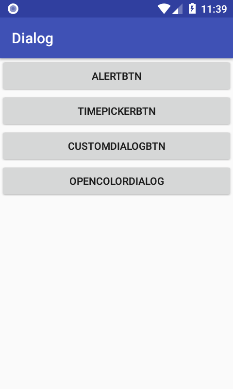

# Android-Learn-Tasks
<h3>Dialog</h3>

<h4>ColorPickerDialog.png</h4>

<h4>CustomDialog.png</h4>

<h4>TimePickerDialog.png</h4>

<h4>activity_dialog.png</h4>

<h4>activity_dialog_Ex.png</h4>

<h4>alertDialog.png</h4>

