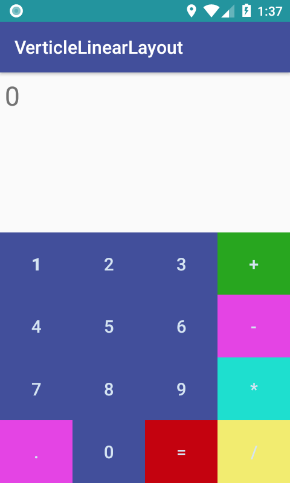
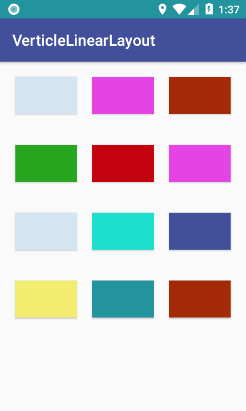
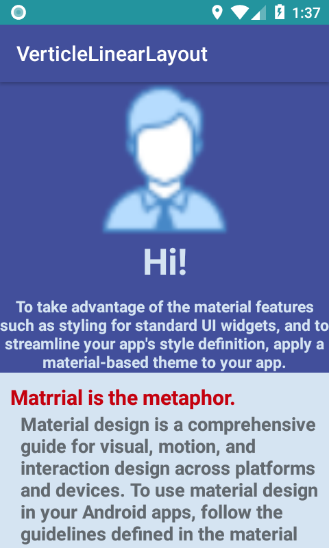
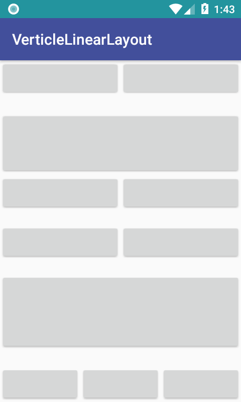
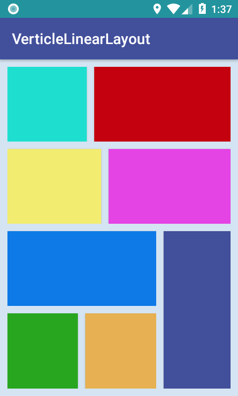
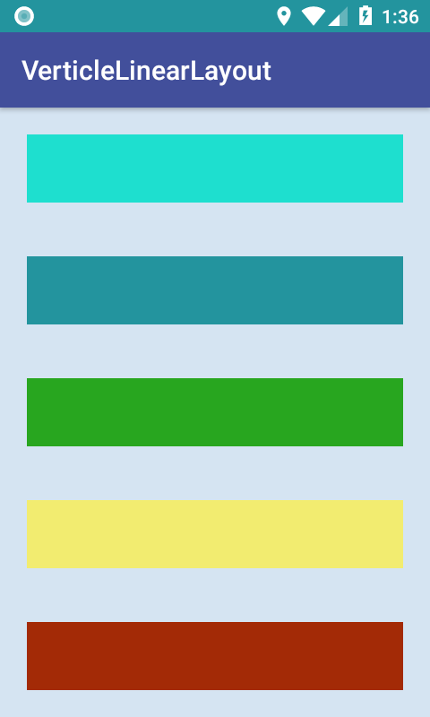
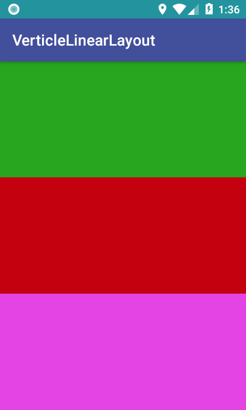

# Android-Learn-Tasks
<h3>LinearLayout</h3>

<h4>calculatorlinear_activity_layout.png</h4>

<h4>horozontallinear_activity_layout.png</h4>

<h4>imagelinear_activity_layout.png</h4>

<h4>linearbutton_activity_layout.png</h4>

<h4>verticalhorozontallinear_activity_layout.png</h4>

<h4>verticlelinear_activity_layout.png</h4>

<h4>verticlelinearbutton_activity_layout.png</h4>

