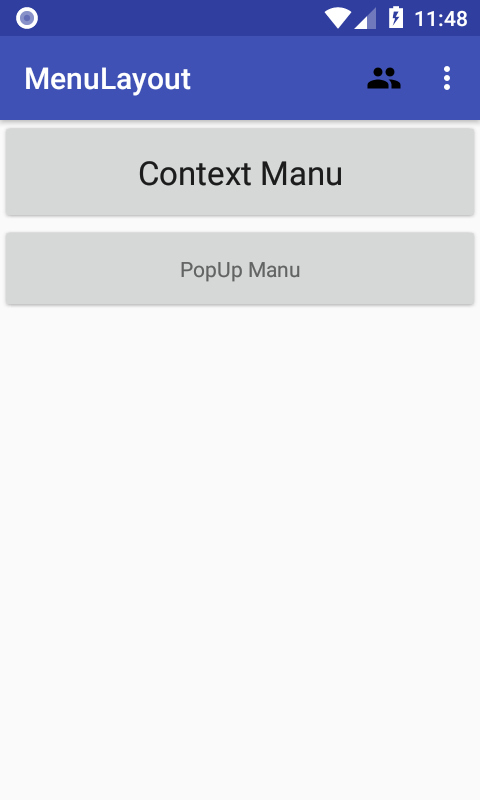
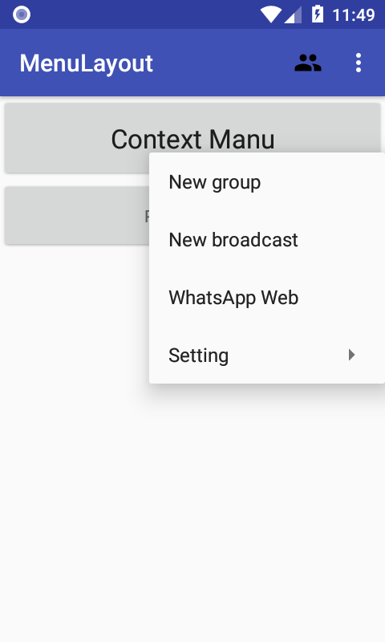
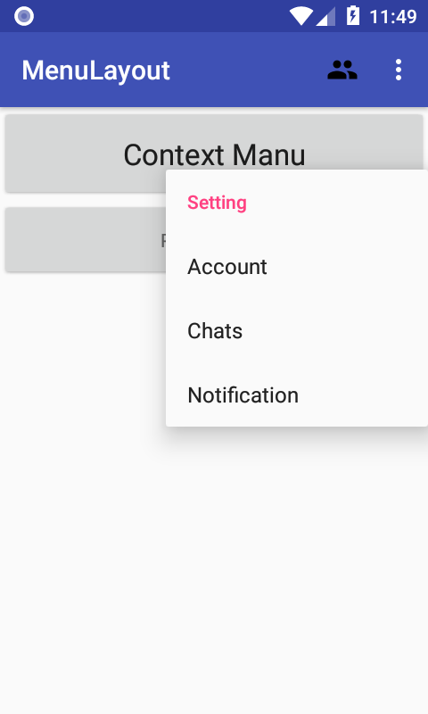
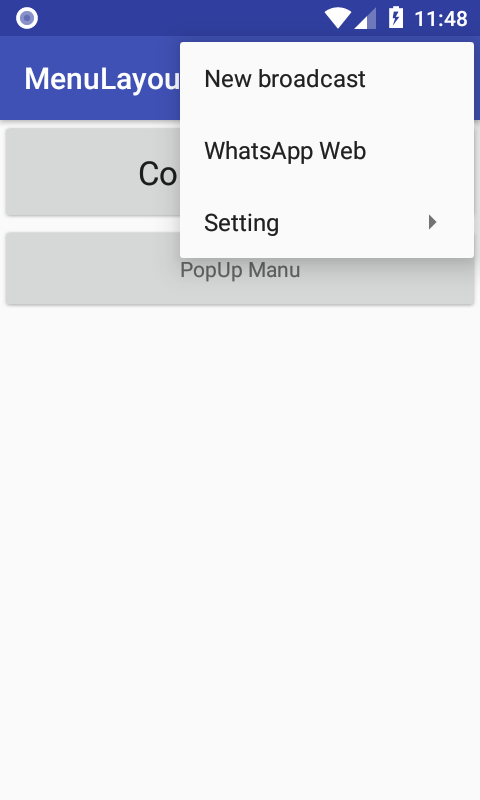
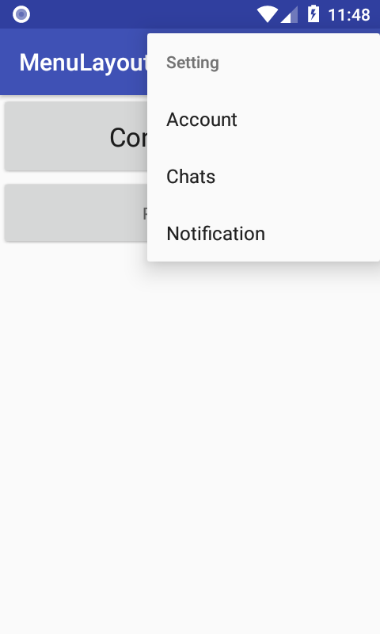
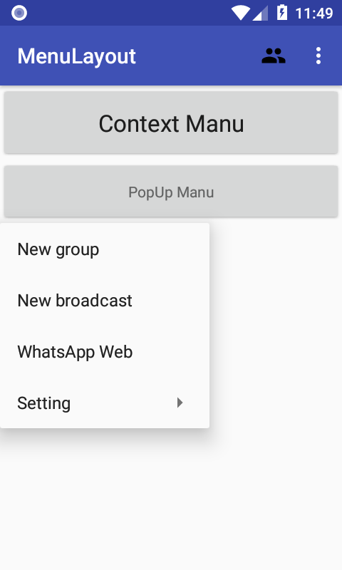
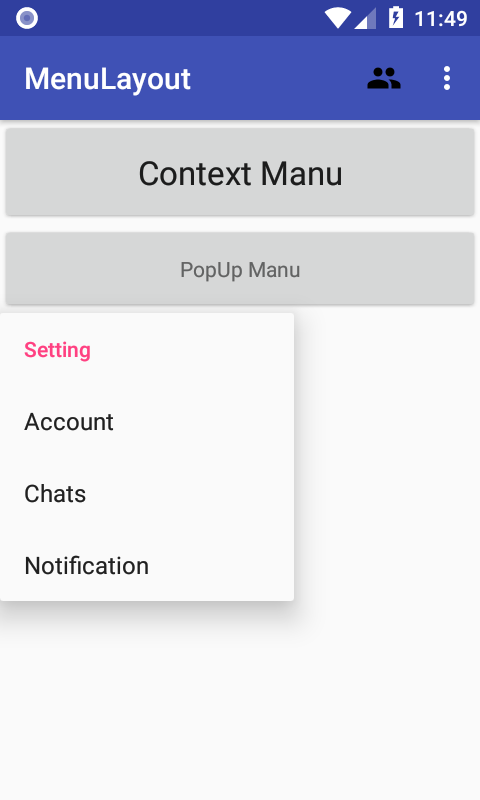

# Android-Learn-Tasks
<h3>MenuLayout</h3>

<h4>activity_manu.png</h4>

<h4>longPressContextManu.png</h4>

<h4>longPressContextManuSetting.png</h4>

<h4>optionMenu.png</h4>

<h4>optionMenuSetting.png</h4>

<h4>singleClickPopupMenu.png</h4>

<h4>singleClickPopupMenuSetting.png</h4>

