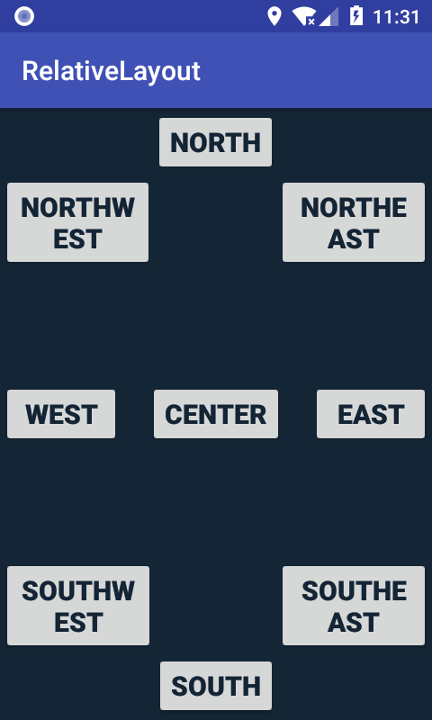

# Android-Learn-Tasks
<h3>RelativeLayout</h3>

<h4>button_activity_main.png</h4>

<h4>buttonalign_activity_main.png</h4>

<h4>buttonbox_activity_main.png</h4>

<h4>buttoncenter_activity_main.png</h4>

<h4>buttoncenterr_activity_main.png</h4>

<h4>buttonlayout_activity_main.png</h4>

<h4>buttonrelativee_activity_main.png</h4>

<h4>buttontextview_activity_main.png</h4>

<h4>buttonvertical_activity_main.png</h4>

<h4>buttonverticall_activity_main.png</h4>

<h4>imagetask_activity_main.png</h4>

